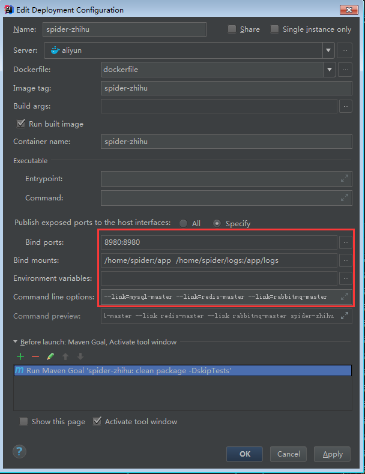

# 项目启动说明

1. <a href="#run-local">本地启动</a>
2. <a href="#run-remote">部署到阿里云</a>

## <div id="run-local">本地启动</div>

> 基础环境要求: `mysql5.6+`,`JDK1.8`,`Maven3.5.3+`

1. Windows下安装Redis

直接在[redis版本库](https://github.com/microsoftarchive/redis/releases)中选取一个版本`msi`格式的redis，下载后按默认配置安装即可。

2. Windows下安装RabbitMQ

预先在[Erlang官网](https://www.erlang.org/downloads)，选取64位的二进制文件，下载后按默认配置安装erlang。

然后在[RabbitMQ官网](https://www.rabbitmq.com/install-windows.html)，下载可执行文件的RabbitMQ安装包，按默认配置安装。

接着在RabbitMQ所在目录的sbin目录在执行命令`rabbitmq-plugins enable rabbitmq_management`安装RabbitMQ管理插件。

最后通过菜单栏提供的启动链接或直接命令启动，以`guest:guest`用户及密码访问`localhost:15672`即可管理rabbitMQ实例。

3. Windows下安装RocketMQ

预先在[RocketMQ官网](http://rocketmq.apache.org/)或[RocketMQ-GtHub](https://github.com/apache/rocketmq/releases)下载

然后安装

4. 创建数据库`spider`

```sql
create database if not exists spider;
```

5. 在虚拟机安装`ElasticSearch`

ElasticSearch的详细安装教程可参考[我的博客-springboot整合ElasticSearch](https://blog.csdn.net/UtopiaOfArtoria/article/details/88403459)。
按教程说明安装成功后，修改配置文件`application-dev.properties`中与elasticsearch相关配置（ip地址以及集群名称） 即可。

6. 启动项目

执行`mvn springboot:run`命令或在开发工具帮助下，即可启动项目。

## <div id="run-remote">部署到阿里云</div>

> 基础环境要求: 需要`docker`环境

需要在阿里云的安全策略中开发如下端口:


IDEA通过2375端口测试目标服务器是否具备docker环境，因此需要更改`docker`的配置文件如下：

```bash
vim /usr/lib/systemd/system/docker.service
# 在ExecStart=/usr/bin/dockerd-current 后面加上
-H tcp://0.0.0.0:2375 -H unix://var/run/docker.sock
# 重启docker服务使配置生效
systemctl daemon-reload
systemctl restart docker
```

- docker部署mysql

```bash
docker pull mysql
docker run --name mysql-master -p 3306:3306 -e MYSQL_ROOT_PASSWORD=root -d mysql
# mysql8.0+换了加密规则；navcat无法直接联通，需要重新设置加密规则
docker exec -it mysql-master bash
mysql -u root -p
# {password}是占位符，内容就是设置的密码，为了方便好记可以直接使用root（生产环境慎用）
ALTER USER 'root'@'%' IDENTIFIED BY '{password}' PASSWORD EXPIRE NEVER;
ALTER USER 'root'@'%' IDENTIFIED WITH mysql_native_password BY '{password}';
FLUSH PRIVILEGES;
```

- docker部署redis

```bash
docker pull redis
docker run -d --name redis-master -p 6379:6379 redis
```

- docker部署rabbitmq

```bash
docker pull rabbitmq
docker run -d --name rabbitmq-master -p 5672:5672 -p 15672:15672 rabbitmq
# 还需要安装rabbitmq管理插件
docker exec -it rabbitmq-master /bin/bash
rabbitmq-plugins enable rabbitmq_management
```

- docker部署rocketmq

```bash
docker pull rocketmqinc/rocketmq
docker pull styletang/rocketmq-console-ng
docker run -d -p 9876:9876 -v `pwd`/data/namesrv/logs:/root/logs -v `pwd`/data/namesrv/store:/root/store --name rmqnamesrv  rocketmqinc/rocketmq sh mqnamesrv
# conf/broker.conf文件增加配置项brokerIP1 = xxx.xxx.xxx.xxx。这里的ip地址指定为外网地址。并且docker启动时需要增加命令参数-c ../conf/broker.conf。因为rockerMQ broker默认会选择内网地址。只有当参数行中有-c参数时才会使用配置文件的参数
docker run -d -p 10911:10911 -p 10909:10909 -v `pwd`/data/broker/logs:/root/logs -v `pwd`/data/broker/store:/root/store --name rmqbroker --link rmqnamesrv:namesrv -e "NAMESRV_ADDR=namesrv:9876" rocketmqinc/rocketmq sh mqbroker -c ../conf/broker.conf
# 这里的地址，我指定为外网ip，如果指定127.0.0.1::9876会出现无法访问的bug
docker run -e "JAVA_OPTS=-Drocketmq.namesrv.addr=xxx.xxx.xxx.xxx:9876 -Dcom.rocketmq.sendMessageWithVIPChannel=false" -p 8080:8080 -t styletang/rocketmq-console-ng
```

- 编写dockerfile文件如下：

```dockerfile
FROM java:8

MAINTAINER zhenye

EXPOSE 8980

VOLUME /tmp

RUN mkdir /app

RUN mkdir /app/logs

ADD target/spider-1.0.0.jar /app/spider-1.0.0.jar

ENTRYPOINT java -server -Xms512M -Xmx512M  -Xmn256M -XX:MetaspaceSize=128M -XX:MaxMetaspaceSize=128M -Xdebug -Xrunjdwp:server=y,transport=dt_socket,suspend=n,address=8080 -Xverify:none -XX:+DisableExplicitGC -Djava.awt.headless=true -Djava.security.egd=file:/dev/./urandom -Duser.timezone=GMT+08 -Dspring.profiles.active=prod -jar /app/spider-1.0.0.jar
```

然后利用IDEA插件---`docker integration`配置参数如下：



- 服务器的mysql中需要创建数据库spider

```sql
create database if not exists spider;
```

- 删除源码中与ElasticSearch的源码（感兴趣的同学，可以自己在阿里云本机安装好ElasticSearch，然后添加相关ElasticSearch配置）

- 启动项目

基于dockerfile文件，将当前项目发布到阿里云服务器即可。

# 项目思路

1. 启动项目时，会执行一个初始化任务---爬取西刺网的前10页免费代理，放入RabbitMQ中，RabbitMQ会启动10个线程（10个消费者）判断这些代理是否可用，并将这些代理以及测试结果保存在Mysql中。
2. 基于Spring提供的计划调度，每15分钟会测试一下Mysql中所有代理放入RabbitMQ中，10个消费者会测试这些代理的可用性并更新其成功次数和失败次数（`success_times`,`fail_times`）,如果连续3次都测试失败，会把这样的代理从DB中删除。
3. 基于Spring提供的计划调度，每10分钟会把Mysql中成功次数`success_times`最高的10条代理，放入redis中，保证redis中的代理都是高可用的免费代理。
4. 基于Spring提供的计划调度，每30分钟会爬取西祠网首页的所有免费代理，放入rabbitMQ中，10个消费者会测试这些代理的可用性并将结果保存到Mysql中。
5. 基于1-4步，相当于我们在redis中维护了一个高可用的免费代理池。每次爬取数据时，从这个免费代理池中选取一条代理，可以做到一定程度的反反爬虫。
6. 项目向外暴露了三个接口`ip:8980/users/info?urlToken=#{urlToken}`，`ip:8980/users/followees?urlToken=#{urlToken}`，`ip:8980/users/followers?urlToken=#{urlToken}`。第一个接口是爬取知乎用户的数据（每个知乎用户有唯一的urlToken）;第二个接口是爬取该知乎用户关注的所有用户的数据；第三个接口是爬取该知乎关注该用户的所有用户的数据。通过调用这三个接口，我们会把想爬取的知乎用户数据保存在mysql的`spider.user`表中。
7. 利用mysqldump工具备份爬取的原始知乎用户数据保存到user_copy表中，然后调用项目暴露的接口`ip:8980/users/filter`，利用布隆算法进行知乎用户数据的去重。
8. 调用项目暴露的接口`ip:8980/users/transfer`，把去重后的知乎用户数据导入ElasticSearch中。
9. 利用ElasticSearch以及其Kibana插件分析知乎用户数据，将分析后的结果进行汇总后，用其自带画图工具或Echarts进行分析结果的可视化。

# 说明

详细的知乎用户爬取分析项目的设计思路以及代码实现可以参考[我的博客---百万知乎用户数据分析](https://blog.csdn.net/UtopiaOfArtoria/article/details/100077249)。